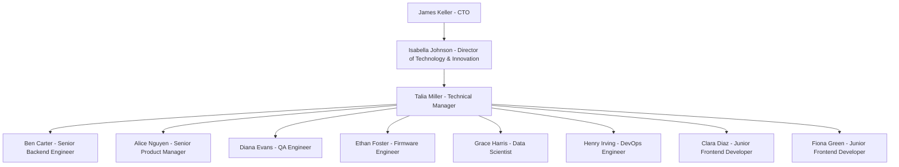

# People

## Overview

This note serves as a springboard for exploring topics related to people.

## Org chart

## Team Members

Team members are:

- [[alice]]
- [[ben]]
- [[clara]]
- [[diana]]
- [[ethan]]
- [[fiona]]
- [[grace]]
- [[henry]]

Below is a summary of their role and background:

| Name             | Role                     | Seniority Level | Background Summary                                                                                                     |
|------------------|--------------------------|-----------------|------------------------------------------------------------------------------------------------------------------------|
| **Alice Nguyen** | Senior Product Manager   | Senior          | With 8 years of experience in IoT products, Alice specializes in bridging technical teams with business objectives. Passionate about user-centric design and coffee culture. |
| **Ben Carter**   | Senior Backend Engineer  | Senior          | With 10 years of experience, Ben is an expert in integration systems (ESB, MuleSoft). He enjoys optimizing system performance and is a coffee enthusiast who experiments with home roasting. |
| **Clara Diaz**   | Frontend Developer       | Junior          | Recent graduate passionate about mobile app development and UX/UI. Enthusiastic about creating intuitive interfaces and excited to learn more about mood-driven applications. |
| **Diana Evans**  | QA Engineer              | Intermediate    | Diana has 4 years of QA experience, focusing on IoT hardware and software testing. She loves automation testing frameworks and is meticulous about quality assurance. |
| **Ethan Foster** | Firmware Engineer        | Intermediate    | Ethan has 7 years of embedded systems experience, specializing in Arduino-based projects. He frequently tinkers with hardware at home, building smart home gadgets as a hobby. |
| **Fiona Green**  | Frontend Developer       | Junior          | Fiona recently graduated from university with a degree in computer science and UX design. She is enthusiastic about mobile app development and user experience improvements. |
| **Grace Harris** | Data Scientist           | Intermediate    | Grace joined the team with 3 years of experience in machine learning models for emotion detection. She is fascinated by the intersection of psychology and data science. |
| **Henry Irving** | DevOps Engineer          | Intermediate    | Henry has 6 years of cloud infrastructure experience (AWS, Azure). He is passionate about reliable deployments, monitoring, and continuous integration/delivery pipelines. |

## Senior Management

I report to [[isabella]] and Isabelle reports to James. Below is a summary of their role and background:

| Name                  | Role                                  | Seniority Level   | Background Summary                                                                                                       |
|-----------------------|---------------------------------------|-------------------|--------------------------------------------------------------------------------------------------------------------------|
| **Isabella Johnson**  | Director of Technology & Innovation   | Director          | Isabella has over 15 years of leadership experience in technology-driven consumer products and IoT ecosystems. Known for her strategic vision and passion for innovation, she previously led successful digital transformation initiatives at multiple Fortune 500 companies. Isabella strongly advocates for sustainable practices and believes technology should enhance both user experiences and environmental responsibility. |
| **James Keller**      | Chief Technology Officer (CTO)        | C-Level           | James brings over 20 years of executive leadership in technology innovation, analytics, automation, and AI-driven consumer experiences. Previously CTO at a leading retail brand, he successfully led omnichannel digital transformations that boosted revenue growth through advanced analytics and automation initiatives. James is passionate about leveraging technology to enhance customer engagement across multiple channels. |
| **Karen Lee**         | Director of Digital Transformation    | Director          | Karen has over 12 years of experience leading digital transformation strategies within consumer-facing industries. She specializes in integrating AI-driven analytics into customer relationship management, supply chain optimization, and product innovation processes. Karen previously spearheaded transformative digital initiatives at global consumer brands, significantly increasing operational efficiency and customer satisfaction scores. |
| **Liam Martinez**     | Director of Product & Growth          | Director          | Liam brings 14 years of expertise in product management, growth strategy, and innovation within consumer technology sectors. His background includes leading cross-functional teams to deliver successful digital products that drive significant user adoption and market expansion. Liam excels at identifying market trends, understanding customer needs deeply, and translating insights into actionable product strategies aligned with business goals.|

## Key Stakeholders

Our key stakeholders are as follows:

| Name                  | Department / Team           | Seniority Level   | Background Summary                                                                                                       |
|-----------------------|-----------------------------|-------------------|--------------------------------------------------------------------------------------------------------------------------|
| **Maya Patel**        | Supply Chain & Procurement  | Senior            | Maya has over 10 years' experience managing complex global supply chains within the coffee industry. She specializes in sustainable sourcing practices and ethical procurement strategies aimed at improving livelihoods for smallholder farmers while optimizing operational efficiency.|
| **Noah Quinn**        | Marketing & Brand Strategy  | Senior            | Noah brings 9 years' expertise in brand positioning, digital marketing campaigns, and customer engagement strategies within the food & beverage sector. He previously led successful brand revitalization projects that significantly increased market share through innovative storytelling techniques focused on sustainability and community impact.|
| **Olivia Reynolds**   | Customer Experience (CX)    | Senior            | Olivia has over 11 years' experience designing exceptional customer experiences across retail environments and digital platforms within the hospitality industry. She excels at leveraging customer insights to drive loyalty programs, personalization initiatives, and service excellence standards that consistently enhance customer satisfaction scores.|
| **Peter Sullivan**    | Sustainability & CSR        | Lead              | Peter has more than 12 years' experience leading sustainability initiatives across multinational corporations in the coffee sector. He specializes in regenerative agriculture practices, climate resilience programs, biodiversity conservation efforts, and community empowerment initiatives aimed at achieving net-zero carbon production goals.|

**Tags**

#Team #Manager #SeniorManagement #Stakeholder
