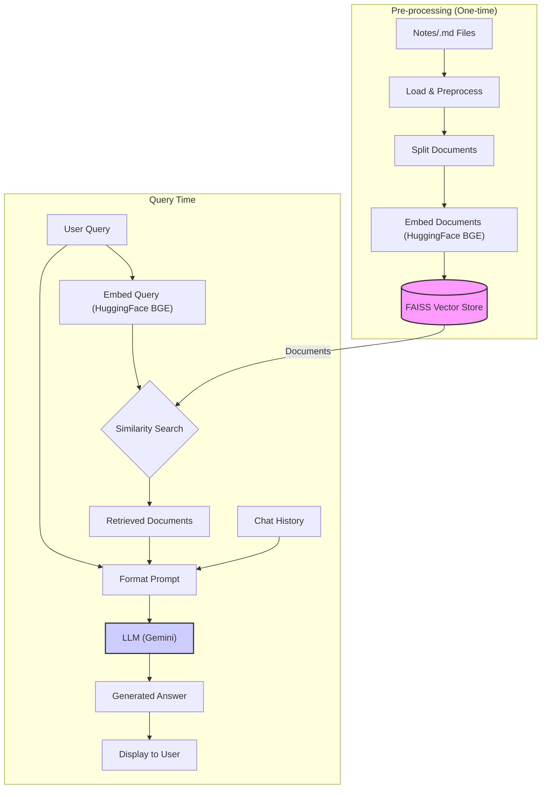

# README

# Personal Notes Chatbot with RAG and Streamlit

This project implements a chatbot to query personal notes assistant using Retrieval-Augmented Generation (RAG), [LangChain](https://python.langchain.com/docs/introduction/), and [Streamlit](https://streamlit.io). It allows you to ask questions about a collection of Markdown notes and receive answers based on the content of those notes. This project has two key goals:

1.  **Build a functional RAG system:** To demonstrate how RAG can be leveraged to interact with a knowledge base.
2.  **Showcase best practices for note-taking:** To illustrate effective note-taking strategies for technical managers, using the "Brewtiful" notes as an example.

This README covers the technical aspects of the RAG system, the project structure, setup, usage, and code explanations. For a deeper dive into the note-taking best practices, please see the [`Notes/README.md`](Notes/README.md) file.

## Table of Contents

1.  [Key Concepts: The RAG Workflow](#1-key-concepts-the-rag-workflow)
    *   [RAG (Retrieval-Augmented Generation)](#rag-retrieval-augmented-generation)
    *   [Pre-processing (One-time)](#pre-processing-one-time)
    *   [Query Time Processing](#query-time-processing)
2.  [The "Brewtiful" Notes Knowledge Base](#2-the-brewtiful-notes-knowledge-base)
3.  [Code Overview (`brewtiful.py`)](#3-code-overview-brewtifulpy)
4.  [Design Choices](#4-design-choices)
    *   [Model Selection](#model-selection)
    *   [Vector Store Selection](#vector-store-selection)
    *   [Parameter Tuning & Implementation Choices](#parameter-tuning--implementation-choices)
5.  [Challenges Encountered](#5-challenges-encountered)
    *   [Gemini Rate Limits](#gemini-rate-limits)
    *   [Filtering Multi-Value Metadata](#filtering-multi-value-metadata)
    *   [Handling Missing Frontmatter](#handling-missing-frontmatter)
6.  [Setup and Installation](#6-setup-and-installation)
7.  [Usage](#7-usage)

## 1. Key Concepts: The RAG Workflow

This section explains the core concepts behind the Retrieval-Augmented Generation (RAG) system, following the flow illustrated in the diagram below.

### RAG (Retrieval-Augmented Generation)

RAG combines information retrieval with text generation. Instead of relying solely on its internal knowledge, the system first retrieves relevant information from a specific knowledge base (our Brewtiful Markdown notes) and then uses that information, along with the user's query and conversation history, to generate a more informed and contextually accurate answer.



### Pre-processing (One-time)

This initial setup phase prepares the knowledge base for efficient retrieval.

1.  **Notes/.md Files:** The source of knowledge is a collection of Markdown files located in the `Notes/` directory.
2.  **Load & Preprocess:** The system reads these files, extracts the main content, and parses metadata (like title, tags, categories) from the YAML front matter using the `load_and_preprocess_notes` function.
3.  **Split Documents:** Long notes are broken down into smaller, overlapping chunks using LangChain's `RecursiveCharacterTextSplitter` via the `split_documents` function. This ensures that semantic context isn't lost at chunk boundaries and makes processing more manageable.
4.  **Embed Documents:** Each text chunk is converted into a numerical vector (an **embedding**) using a sentence transformer model ([`BAAI/bge-small-en-v1.5`](https://huggingface.co/BAAI/bge-small-en-v1.5)) accessed via `langchain_huggingface.HuggingFaceEmbeddings`. These embeddings capture the semantic meaning of the text, allowing similar concepts to be represented by vectors that are close together in multi-dimensional space.
5.  **Vector Store ([FAISS](https://engineering.fb.com/2017/03/29/data-infrastructure/faiss-a-library-for-efficient-similarity-search/)):** The generated embeddings and their corresponding text chunks (as LangChain `Document` objects) are stored and indexed in a **Vector Store**. This project uses **[FAISS](https://engineering.fb.com/2017/03/29/data-infrastructure/faiss-a-library-for-efficient-similarity-search/)** (Facebook AI Similarity Search) via `langchain_community.vectorstores.FAISS`. FAISS is highly optimized for fast **similarity searches** over large sets of vectors.

### Query Time Processing

This phase occurs each time the user asks a question.

1.  **User Query:** The user inputs their question via the **Streamlit** interface.
2.  **Embed Query:** The user's query text is converted into an embedding using the *same* Hugging Face model (`BAAI/bge-small-en-v1.5`) that was used for the documents.
3.  **Similarity Search:** The query embedding is compared against all the document embeddings stored in the **[FAISS](https://engineering.fb.com/2017/03/29/data-infrastructure/faiss-a-library-for-efficient-similarity-search/)** Vector Store. FAISS efficiently calculates similarity scores (e.g., using cosine similarity) and identifies the document chunks whose embeddings are closest to the query embedding. *(Note: In this specific implementation, filtering based on sidebar selections happens *before* this step by creating a temporary, filtered FAISS index for the search).*
4.  **Retrieved Documents:** The most similar document chunks (typically the top 'k', e.g. here top 3) are retrieved from the vector store. These serve as the context for the language model.
5.  **Chat History:** The history of the current conversation is retrieved from **LangChain's `ConversationBufferMemory`**, managed within Streamlit's session state. This provides conversational context.
6.  **Format Prompt:** A **prompt** is constructed using **LangChain's `ChatPromptTemplate`**. This template combines the user's original query, the content of the retrieved documents (formatted by `format_docs`), and the chat history, along with system instructions guiding the LLM's behavior.
7.  **LLM (Large Language Model):** The complete prompt is sent to the **LLM**. This project uses Google's **Gemini** model ([`gemini-2.0-flash-lite`](https://deepmind.google/technologies/gemini/flash-lite/)) via `langchain_google_genai.ChatGoogleGenerativeAI`. The LLM processes the input and generates a response based *only* on the provided context and history.
8.  **Generated Answer:** The LLM produces the final answer text.
9.  **Display to User:** The generated answer is displayed back to the user in the **Streamlit** chat interface.

**LangChain** acts as the orchestrator, providing the framework and components (Splitter, Embeddings interface, Vector Store interface, Memory, Prompt Template, LLM interface, Runnables) to connect these steps into a coherent RAG chain. **Streamlit** provides the interactive web user interface.

## 2. The "Brewtiful" Notes Knowledge Base

The `Notes/` directory contains a sample knowledge base for a fictional company, "Brewtiful," which makes smart coffee machines. These notes demonstrate effective note-taking for technical managers, structured using principles inspired by Zettelkasten:

*   **Folder Structure:** Notes are organized into domains like `Journal/`, `People/`, `Product/`, `TechnicalNotes/`. See [Notes/README.md](Notes/README.md) for details.
*   **Atomic Notes:** Each note focuses on a single idea.
*   **Metadata:** YAML front matter in each note includes `title`, `tags`, `categories`, etc., used for filtering.
*   **Interlinking:** Wiki-style links (`[[Note Title]]`) connect related ideas (though not directly used by the RAG retrieval in this version).
*   **Springboard Files:** Each main folder has a `_springboard.md` file acting as an index.

This structured collection serves as the data source for the RAG system.

## 3. Code Overview (`brewtiful.py`)

The application logic is defined in [brewtiful.py](brewtiful.py) (or the corresponding [brewtiful.ipynb](brewtiful.ipynb) notebook):

1.  **Setup:** Imports libraries and loads the `GOOGLE_API_KEY` from a `.env` file.
2.  **Function Definitions:**
    *   [`initialize_session_state`](brewtiful.py): Sets up Streamlit session state variables.
    *   [`load_and_preprocess_notes`](brewtiful.py): Reads `.md` files from the `Notes/` directory, extracts content and YAML front matter, skipping `README.md`.
    *   [`split_documents`](brewtiful.py): Splits loaded notes into smaller chunks using `RecursiveCharacterTextSplitter`.
    *   [`filter_documents`](brewtiful.py): Filters documents based on user selections (title, categories, tags) from the sidebar.
    *   [`format_docs`](brewtiful.py): Formats retrieved documents for the LLM prompt.
    *   [`get_chat_history`](brewtiful.py): Retrieves formatted chat history from memory.
    *   [`create_chain`](brewtiful.py): Builds the LangChain RAG chain, combining the prompt, retriever, LLM, and memory access.
3.  **Main Application Logic (`main` function):**
    *   Initializes session state, loads/processes notes, creates embeddings, and sets up the FAISS vector store, LLM, and memory (cached in session state).
    *   Builds the Streamlit UI (sidebar filters, preloaded question buttons, chat interface).
    *   Handles user input (from chat input or buttons).
    *   When a query is received:
        *   Applies filters to get relevant documents.
        *   Creates a *temporary* FAISS index and retriever based *only* on the filtered documents for the current query.
        *   Invokes the LangChain RAG chain with the query, filtered retriever, and memory.
        *   Displays the response and updates chat history and memory.
        *   Handles cases where filters result in no documents.

## 4. Design Choices

This section outlines some of the key design decisions made during the development of this RAG system.

### Model Selection

*   **Embedding Model ([`BAAI/bge-small-en-v1.5`](https://huggingface.co/BAAI/bge-small-en-v1.5) via Hugging Face):**
    *   **Advantage:** This model offers a good balance between performance (quality of embeddings) and resource requirements (size, speed). Being relatively small, it runs in memory, making it suitable for deployment scenarios, such as on Streamlit, while avoiding the API rate limits and potential costs associated with cloud-based embedding services (as encountered initially with [Gemini](https://ai.google.dev/gemini-api/docs/rate-limits)). It's specifically designed for retrieval tasks, making it suitable for RAG.
*   **Text Generation Model ([`gemini-2.0-flash-lite`](https://deepmind.google/technologies/gemini/flash-lite/) via Google AI):**
    *   **Advantage:** This model provides fast response times and strong general language understanding capabilities at a relatively low cost compared to larger Gemini models. It's well-suited for conversational tasks and generating concise answers based on provided context, making it a good fit for this chatbot application. Its integration via `langchain_google_genai` is straightforward.
    *   **Temperature (`0.5`):** This parameter controls the randomness of the LLM's output. A value closer to 0 makes the output more deterministic and focused, while a value closer to 1 makes it more creative and diverse. `0.5` provides a balance, aiming for helpful and factual answers based on the context, while allowing for some natural language variation.

### Vector Store Selection

*   **[FAISS (Facebook AI Similarity Search)](https://engineering.fb.com/2017/03/29/data-infrastructure/faiss-a-library-for-efficient-similarity-search/):**
    *   **Advantage:** FAISS is a highly optimized library specifically designed for efficient similarity search and clustering of dense vectors. It's known for its speed and scalability, even with millions of vectors. It runs in memory, integrating well with the embedding model and avoiding external dependencies or costs for the core retrieval mechanism. [`langchain_community.vectorstores.FAISS`](https://python.langchain.com/v0.1/docs/integrations/vectorstores/faiss/) provides a convenient wrapper.

### Parameter Tuning & Implementation Choices

Several parameters and implementation details influence the RAG process. The values chosen represent a starting point and might need adjustment based on the specific dataset and desired behavior:

*   **Retriever `k` (Number of Documents to Retrieve):** Set to `3` in the `dynamic_retriever = db_filtered.as_retriever(search_kwargs={"k": 3})` line.
    *   **Effect:** This determines how many document chunks are retrieved from the vector store to be used as context for the LLM.
        *   *Too low:* May miss relevant information needed to answer the query accurately.
        *   *Too high:* May overwhelm the LLM with excessive or irrelevant context, potentially diluting the important information, increasing processing time, and hitting context window limits. `k=3` aims for a balance, providing sufficient context without being excessive for typical queries.
*   **Text Splitter (`RecursiveCharacterTextSplitter`):**
    *   **Choice:** This splitter attempts to divide text based on a **prioritized list of separators**. By default, it tries `["\n\n", "\n", " ", ""]`. This means it first tries to split the text wherever it finds a double newline (`\n\n`, typically representing a paragraph break). If the resulting chunks are still too large, it then tries splitting by single newlines (`\n`, representing line breaks). If that's still not enough, it tries splitting by spaces (` `), and finally, as a last resort, by individual characters (`""`). It's a good general-purpose choice for plain text and markdown, as this prioritized approach aims to keep paragraphs and sentences intact where possible before resorting to finer splits.
*   **Chunk Size:** Set to `1000` characters in `split_documents`.
    *   **Effect:** Defines the maximum length of each text chunk created by the splitter.
        *   *Smaller chunks:* Ensure more granular retrieval but might split related sentences or ideas, potentially losing local context.
        *   *Larger chunks:* Preserve more local context within a chunk but might contain less focused information, potentially making retrieval less precise if a query matches only a small part of a large chunk. `1000` is a common starting point, aiming to capture paragraphs or logical sections.
*   **Chunk Overlap:** Set to `50` characters in `split_documents`.
    *   **Effect:** Defines the number of characters that overlap between consecutive chunks.
        *   **Purpose:** Helps mitigate the issue of relevant sentences being split exactly at chunk boundaries. By having overlap, a sentence starting near the end of one chunk will also be present at the beginning of the next, increasing the chance it's fully captured during retrieval if relevant. `50` provides a small buffer without adding excessive redundancy.
*   **Caching Strategy (`st.session_state`):**
    *   **Choice:** Key components like the loaded notes, processed documents, embeddings model, the main FAISS vector store (`st.session_state.db`), the LLM instance, and the conversation memory are stored in Streamlit's session state after their initial creation. 
    *   **Advantage:** The special Streamlit caching strategy is needed because of how Streamlit applications work. Streamlit re-runs the entire script from top to bottom on every user interaction (e.g., clicking a button, entering text). Without caching, this would result in re-initializing expensive components like embeddings, vector stores, and LLMs on every interaction, leading to significant performance issues.
*   **Dynamic Retriever Creation (Filtering):**
    *   **Choice:** When sidebar filters are active, instead of filtering *after* retrieving from the main vector store, the code creates a *new, temporary* FAISS index (`db_filtered`) containing *only* the documents that match the filters. The retriever used for the query (`dynamic_retriever`) is then based on this temporary index.
    *   **Trade-offs:** This approach ensures that the similarity search *only* considers documents matching the filters, potentially improving the relevance of the top 'k' results according to the filter criteria. However, creating a FAISS index, even a temporary one, on every filtered query can be computationally expensive (CPU/time) compared to retrieving from the main index and then filtering the results, especially with a large number of documents. This design prioritizes strict pre-retrieval filtering over potential performance optimization.

## 5. Challenges Encountered

No project works perfectly out of the box, and this one was no exception. Here are some challenges encountered during development and the solutions implemented to address them:

### Gemini Rate Limits

Initial attempts using Google's models for embeddings encountered **[rate limits](https://ai.google.dev/gemini-api/docs/rate-limits)**. Rate limits are restrictions imposed by API providers on how many requests a user can make within a specific time period (e.g., requests per minute). During the initial indexing phase, where every document chunk needs to be converted into an embedding, many API calls are made in quick succession. As a result of hitting these limits, the embedding process could often not be completed successfully.

*   **Resolution:** Switched to using a local Hugging Face embedding model ([`BAAI/bge-small-en-v1.5`](https://huggingface.co/BAAI/bge-small-en-v1.5)) via [`langchain_huggingface.HuggingFaceEmbeddings`](https://python.langchain.com/api_reference/huggingface/embeddings.html)), which runs in memory and avoids external API rate limits for embedding generation.

### Filtering Multi-Value Metadata

Implementing filters for `tags` and `categories` (which are lists in the YAML front matter) required careful logic. A simple equality check was too restrictive. This meant that when a user selected a filter (e.g., a single tag), they would often receive the warning "No documents match the filters.", as few notes had *only* that specific tag or category.

*   **Resolution:** Implemented a subset check (`set(selected_items).issubset(set(document_items))`) in the [`filter_documents`](brewtiful.py) function. This ensures that documents containing *all* the selected tags/categories are returned, even if they also have additional ones. 

### Handling Missing Frontmatter

Not all Markdown files in the knowledge base necessarily contain YAML frontmatter (e.g., `README.md` files, or notes without specific metadata). An initial assumption that all files would have `---` delimiters could lead to errors during the loading and preprocessing phase.

*   **Resolution:** The `load_and_preprocess_notes` function was updated to handle exceptions:
        1.  Explicitly skip any file named `README.md`.
        2.  Check if a file's content starts with `---`. If not, assign an empty dictionary (`{}`) as its metadata.
        3.  If it starts with `---` but a closing `---` is not found, also assign an empty dictionary. This makes the processing robust to files lacking frontmatter.
        4.  Include a `try...except` block around the file reading and processing logic for each file. If any other error occurs (e.g., encoding issues, file corruption), it catches the exception, reports it using `st.error`, and continues to the next file, preventing the entire process from crashing.
    *   **Benefit of Empty Dictionary:** Assigning `{}` ensures that every processed note has a `metadata` attribute which is a dictionary. This provides a consistent structure, simplifying later code (like `split_documents`, `filter_documents`, and sidebar population) which can safely use methods like `metadata.get('key')` without needing extra checks for `None` values, thus preventing potential errors.

## 6. Setup and Installation

1.  **Clone the repository:**
    ```bash
    git clone <your-repository-url>
    cd <your-repository-directory>
    ```
2.  **Create a virtual environment (recommended):**
    ```bash
    python3 -m venv venv
    source venv/bin/activate  # On Linux/macOS
    # venv\Scripts\activate  # On Windows
    ```
3.  **Install dependencies:**
    ```bash
    pip install -r requirements.txt
    ```
    *(Ensure `requirements.txt` includes `streamlit`, `langchain`, `langchain-google-genai`, `langchain-huggingface`, `langchain-community`, `faiss-cpu`, `python-dotenv`)*
4.  **Set up Google API Key:**
    *   Create a `.env` file in the project root.
    *   Add your Google API key (needed for the Gemini LLM):
        ```
        GOOGLE_API_KEY=YOUR_API_KEY
        ```
5.  **Ensure Python Version:** Use Python 3.8 or higher.

## 7. Usage

1.  **Run the Streamlit application:**
    ```bash
    streamlit run brewtiful.py
    ```
2.  Open the provided local URL (e.g., `http://localhost:8501`) in your browser.
3.  Use the sidebar to filter notes by title, category, or tags.
4.  Ask questions using the chat input at the bottom or click the preloaded question buttons.
5.  **Stop the server:** Press `Ctrl+C` in the terminal to stop the Streamlit server.