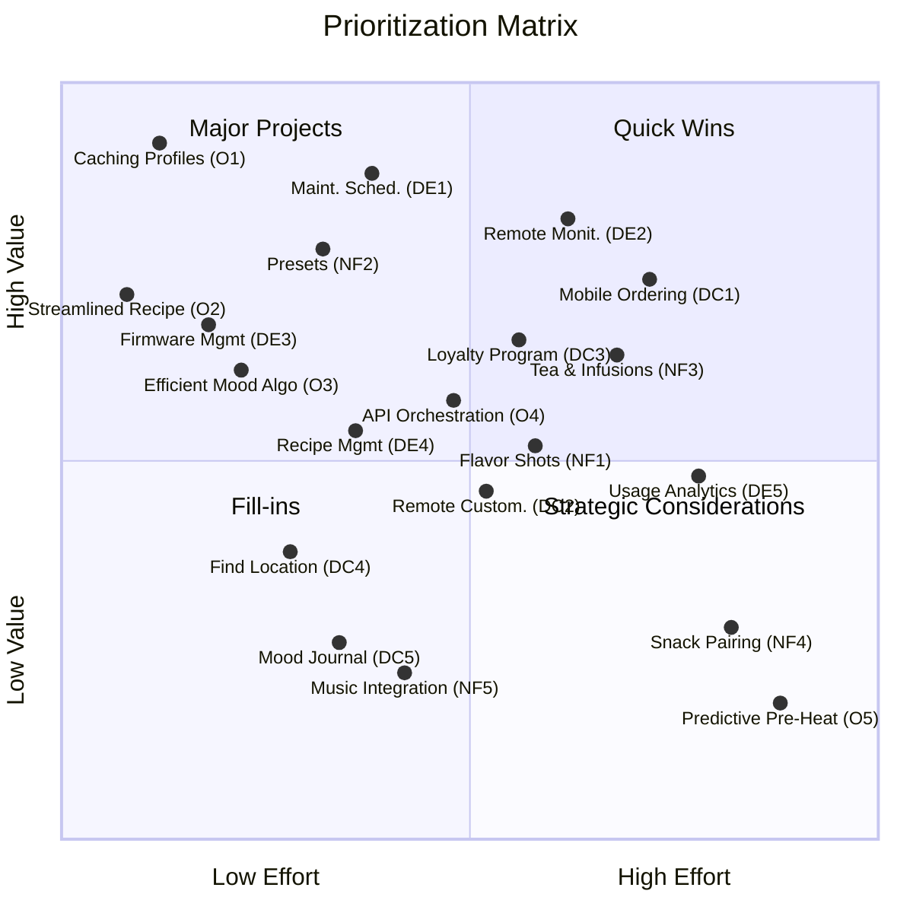
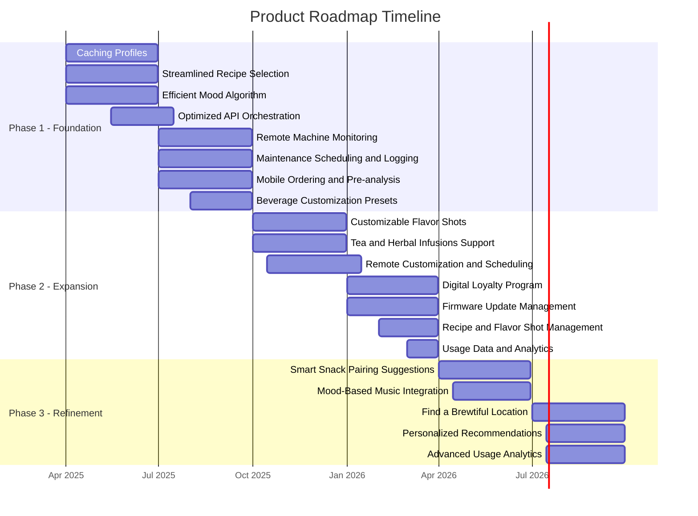

# Product Roadmap

Based on the suggestions from the [[product-backlog]] this note lools at prioritizing the ideas and creating a roadmap

## RICE Evaluation Table:
| Feature Category | Feature | User Type | Reach (Users/Period) | Impact (Scale 1-3) | Confidence (%) | Effort (Person-Months) | RICE Score | Notes |
|---|---|---|---|---|---|---|---|---|
| Optimizations | Caching Frequently Used Profiles | Both | 10000 | 3 | 80 | 1 | 24000 | Core UX improvement, high frequency users |
|  | Optimized API Call Orchestration | Both | 10000 | 2 | 80 | 1.5 | 10667 | System stability, scalability |
|  | Efficient Mood Analysis Algorithm | Both | 10000 | 2 | 70 | 1 | 14000 | Core functionality speed boost |
|  | Streamlined Recipe Selection Process | Both | 10000 | 1.5 | 75 | 0.5 | 22500 | Quick UX win, core flow |
|  | Predictive Ingredient Pre-Heating | Both | 1000 | 1 | 60 | 2 | 300 | Lower reach (peak hour focus), efficiency |
| New Functionalities | Tea and Herbal Infusions Support | Consumer | 5000 | 3 | 70 | 2 | 5250 | Market expansion, broader appeal |
|  | Customizable Flavor Shots | Consumer | 8000 | 2.5 | 75 | 1.5 | 10000 | Enhanced personalization, user delight |
|  | Smart Snack Pairing Suggestions | Consumer | 3000 | 2 | 60 | 2 | 1800 | Holistic experience, partnership needed |
|  | Beverage Customization Presets | Consumer | 7000 | 2 | 80 | 1 | 11200 | User convenience, repeat orders |
|  | Mood-Based Music Integration | Consumer | 2000 | 1 | 50 | 1.5 | 667 | Niche feature, lower confidence |
| Digitalization (Enterprise) | Remote Machine Monitoring | Enterprise | 1000 (Machines) | 3 | 90 | 2 | 13500 | Crucial for enterprise adoption |
|  | Maintenance Scheduling and Logging | Enterprise | 1000 (Machines) | 2.5 | 85 | 1.5 | 14167 | Streamlines maintenance, reduces costs |
|  | Recipe and Flavor Shot Management | Enterprise | 1000 (Machines) | 2 | 80 | 1.5 | 10667 | Centralized control, consistency |
|  | Usage Data and Analytics | Enterprise | 500 (Businesses) | 2 | 70 | 2 | 3500 | Data-driven decisions, optimization |
|  | Firmware Update Management | Enterprise | 1000 (Machines) | 1.5 | 80 | 1 | 12000 | Simplified updates, future-proofing |
| Digitalization (Consumer) | Mobile Ordering and Pre-Analysis | Consumer | 9000 | 3 | 85 | 2 | 11475 | Core app feature, convenience |
|  | Remote Customization and Scheduling | Consumer | 7000 | 2.5 | 80 | 1.5 | 9333 | Enhanced control, user delight |
|  | Digital Loyalty Program and Gamification | Consumer | 6000 | 2 | 75 | 1.5 | 6000 | Retention, engagement |
|  | Find a Brewtiful Location | Consumer | 4000 | 1.5 | 65 | 1 | 3900 | Discoverability, ecosystem growth |
|  | Personalized Recommendations & Mood Journal | Consumer | 3000 | 2 | 60 | 1.5 | 2400 | Deeper personalization, niche feature |

### Assumptions
 * Reach: Estimated based on potential user base. Enterprise features are based on machine/business count.
 * Impact:  Scale 1-3 represents:
   * 3:  Very High Impact - Core UX improvement, significant revenue potential, critical efficiency gain, major user delight.
   * 2.5: High Impact -  Strong UX improvement, good revenue potential, valuable efficiency gain, strong user delight.
   * 2: Medium Impact - Noticeable UX improvement, moderate revenue potential, moderate efficiency gain, noticeable user delight.
   * 1.5: Medium-Low Impact -  Minor UX improvement, some revenue potential, minor efficiency gain, some user delight, but mainly convenience or incremental improvement.
   * 1: Low Impact -  Minimal UX improvement, low revenue potential, limited efficiency gain, very minor user delight, primarily a "nice to have".
 * Confidence:  Percentage reflecting certainty in Reach and Impact estimations. Higher confidence for core functionalities, lower for newer or less validated ideas.
 * Effort:  Estimated in person-months, relative to each other within this backlog.  "1" person-month is a baseline, more complex features are assigned higher effort.

## Prioritization Matrix:

### Interpretation of the Prioritization Matrix:

**Top Left Quadrant (High Value, Low Effort - "Quick Wins"):**
- **Caching Profiles (O1)**: Highest RICE score, relatively low effort. Strong candidate for Phase 1.
- **Streamlined Recipe (O2)**: High RICE, low effort. Phase 1 or early Phase 2.
- **Efficient Mood Algo (O3)**: High RICE, low effort. Phase 1 or early Phase 2.
- **Firmware Mgmt (DE3)**: Enterprise, good RICE, low effort. Phase 2, Enterprise App.
- **Presets (NF2)**: Good RICE, low effort. Phase 1 or Phase 2.
- **Find Location (DC4)**: Lower RICE, low effort. Phase 2/3, if desired for ecosystem expansion.

**Top Right Quadrant (High Value, High Effort - "Major Projects"):**
- **Maintenance Scheduling (DE1)**: Enterprise, High RICE, Medium Effort. Phase 1/2, Enterprise App core.
- **Remote Monitoring (DE2)**: Enterprise, High RICE, Medium Effort. Phase 1, Enterprise App core.
- **Mobile Ordering (DC1)**: Consumer, High RICE, Medium Effort. Phase 1, Consumer App core.
- **API Orchestration (O4)**: Medium-High Value, Medium Effort. Phase 1/2, Foundation for system.
- **Flavor Shots (NF1)**: Medium Value, Medium Effort. Phase 2, Core Feature Expansion.
- **Tea & Infusions (NF3)**: Medium Value, Medium Effort. Phase 2, Market Expansion.
- **Remote Customization (DC2)**: Medium Value, Medium Effort. Phase 2, Consumer App enhancement.
- **Loyalty Program (DC3)**: Medium Value, Medium Effort. Phase 2, Engagement Driver.
- **Recipe Management (DE4)**: Medium Value, Medium Effort. Phase 2, Enterprise Feature.

**Bottom Right Quadrant (Low Value, High Effort - "Strategic Considerations"):**
- **Usage Analytics (DE5)**: Enterprise feature with moderate value but higher effort. Consider for later phases due to strategic importance in data-driven decisions.
- **Snack Pairing (NF4)**: Lower value and high effort; strategic partnership needed; consider in later phases if viable.
- **Predictive Pre-Heat (O5)**: Lower value and high effort; operational efficiency focus with limited user visibility. Consider in later phases if resources permit.

**Bottom Left Quadrant (Low Value, Low Effort - "Fill-ins"):**
- **Mood Journal (DC5)**: Niche personalization feature with lower value but manageable effort; explore user interest in later phases.
- **Music Integration (NF5)**: "Nice to have" feature with lowest priority; consider if resources available in later phases.

## Roadmap based on RICE & Matrix
 
* Phase 1 (Foundation - Speed & Enterprise MVP):
   * Optimizations: Caching Profiles, Streamlined Recipe Selection, Efficient Mood Algorithm, Optimized API Orchestration (start).
   * Enterprise App MVP: Remote Machine Monitoring, Maintenance Scheduling & Logging.
   * Consumer App MVP: Mobile Ordering and Pre-Analysis (basic), Beverage Customization Presets.
 * Phase 2 (Expansion & Engagement):
   * New Functionalities: Flavor Shots, Tea and Herbal Infusions, Beverage Customization Presets (if not in Phase 1).
   * Consumer App Enhancements: Remote Customization & Scheduling, Digital Loyalty Program.
   * Enterprise App Enhancements: Firmware Update Management, Recipe and Flavor Shot Management, Usage Data & Analytics (start).
 * Phase 3 (Differentiation & Refinement):
   * New Functionalities: Smart Snack Pairing Suggestions (if partnership feasible), Mood-Based Music Integration (re-evaluate).
   * Consumer App Enhancements: Find a Brewtiful Location, Personalized Recommendations & Mood Journal.
   * Enterprise App Enhancements: Advanced Usage Analytics & Reporting.

**Tags**   #ProductRoadmap #RICE #Prioritization
