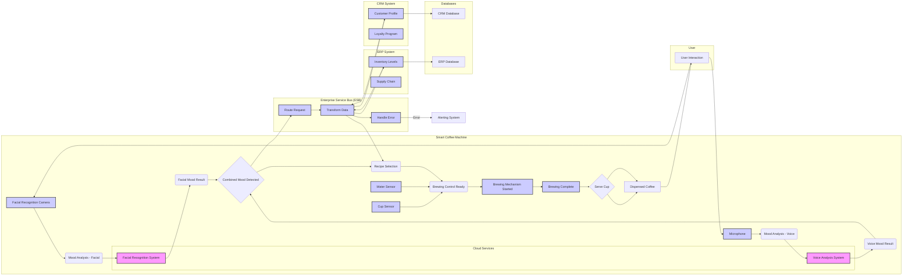

# Brewtiful High-Level Design

## 1. Introduction

This document provides a comprehensive overview of the Brewtiful ecosystem, detailing its architecture, high-level design, component interactions, and API calls. The system centers around a Smart Coffee Machine that provides a personalized and efficient coffee brewing experience by integrating mood analysis, customer preferences, and enterprise systems.

## 2. System Architecture

The system comprises the following key components:

*   Smart Coffee Machine (Core System)
*   Enterprise Service Bus (ESB)
*   Customer Relationship Management (CRM) System
*   Enterprise Resource Planning (ERP) System
*   Voice Analysis System
*   Facial Recognition and Emotion Detection System
*   Coffee Recipe Management System

## 3. Component Details and API Calls

### 3.1 Smart Coffee Machine (Core System)

*   **Purpose:** Brews coffee tailored to the user's mood and preferences, integrating with various enterprise systems.
*   **Technical Details:**
    *   **Microcontroller:** Arduino Uno
    *   **Sensors:** Facial Recognition Camera, Microphone, Water Sensor, Cup Sensor.
    *   **Actuators:** Brewing Mechanism, Dispensing System.
    *   **Connectivity:** Wi-Fi or Ethernet.
    *   **User Interface:** Touchscreen display.
*   **API Calls (Internal):**
    *   `StartBrewing(recipe)`: Initiates the brewing process based on the selected recipe.
    *   `StopBrewing()`: Halts the brewing process.
    *   `Dispense(ingredient, amount)`: Dispenses a specific amount of an ingredient (coffee, milk, sugar).
    *   `GetSensorData(sensorType)`: Retrieves data from a specific sensor (e.g., water level, cup presence).
    *   `SendMoodResults(facialMood, voiceMood)`: Sends mood analysis results to the ESB.

### 3.2 Enterprise Service Bus (ESB) / Middleware

*   **Purpose:** Acts as a central communication hub, routing requests and data between the coffee machine and other enterprise systems. Handles data transformation and protocol conversion.
*   **Technical Details:**
    *   **Technology:** MuleSoft
    *   **Protocols:** HTTP, REST, SOAP, JMS.
    *   **Data Transformation:** Data mapping and transformation tools.
    *   **Error Handling:** Centralized with logging and alerting.
    *   **API Management:** Manages and secures API endpoints.
*   **API Calls (ESB):**
    *   `RouteRequest(destination, payload)`: Routes a request to the specified destination with the given payload.
    *   `TransformData(sourceFormat, targetFormat, data)`: Transforms data from one format to another.
    *   `LogError(errorCode, message)`: Logs an error message with the specified error code.
    *   `GetCustomerProfile(customerId)`: Retrieve customer profile information from the CRM

### 3.3 Customer Relationship Management (CRM) System

*   **Purpose:** Stores and manages customer profiles, purchase history, preferences, and loyalty program information.
*   **Technical Details:**
    *   **Platform:** Salesforce
    *   **Data Storage:** Structured customer data (personal info, purchase history, preferences).
    *   **API:** APIs for retrieving and updating customer data.
    *   **Loyalty Program:** Manages loyalty points and discounts.
*   **API Calls (CRM):**
    *   `GetCustomerProfile(customerId)`: Retrieves a customer profile based on their ID.
    *   `UpdateCustomerPreferences(customerId, preferences)`: Updates a customer's preferences.
    *   `ApplyLoyaltyDiscount(customerId, orderTotal)`: Applies a loyalty discount to an order.
    *   `CreateCustomerProfile(profileData)`: Creates a new customer profile.

### 3.4 Enterprise Resource Planning (ERP) System

*   **Purpose:** Manages inventory, supply chain, and procurement for coffee beans, milk, sugar, and other supplies.
*   **Technical Details:**
    *   **Platform:** SAP
    *   **Data Storage:** Structured customer data (personal info, purchase history, preferences).
    *   **Inventory Management:** Real-time tracking of inventory levels.
    *   **Supply Chain Management:** Manages the supply chain.
    *   **Procurement:** Automates the purchase order process.
*   **API Calls (ERP):**
    *   `CheckInventoryLevel(ingredientId)`: Checks the current inventory level of an ingredient.
    *   `CreatePurchaseOrder(ingredientId, quantity)`: Creates a purchase order for an ingredient.
    *   `UpdateInventoryLevel(ingredientId, quantity)`: Updates the inventory level of an ingredient.

### 3.5 Voice Analysis System

*   **Purpose:** Analyzes the user's voice for emotional tone and motivation levels.
*   **Technical Details:**
    *   **Technology:** Google Cloud Speech-to-Text
    *   **Algorithms:** Machine learning for emotion and stress level detection.
    *   **Output:** Mood (happy, sad, angry) and motivation score.
*   **API Calls (Voice Analysis):**
    *   `AnalyzeVoice(audioData)`: Analyzes audio data and returns a mood score.

### 3.6 Facial Recognition and Emotion Detection System

*   **Purpose:** Identifies facial expressions and maps them to emotional states.
*   **Technical Details:**
    *   **Technology:** OpenCV
    *   **Algorithms:** Convolutional Neural Networks (CNNs) for facial feature and emotion classification.
    *   **Output:** Emotional state (happy, sad, angry) score.
*   **API Calls (Facial Analysis):**
    *   `AnalyzeFace(imageData)`: Analyzes image data and returns a mood score.

### 3.7 Coffee Recipe Management System

*   **Purpose:** Maps emotional states to specific coffee recipes.
*   **Technical Details:**
    *   **Data Storage:** Coffee recipes and corresponding emotional states in a database.
    *   **Algorithms:** Rule-based system
    *   **Recipe Components:** Coffee Blend, Grind Size, Water Temperature, Brewing Time, Milk Type, Sugar/Sweetener, Additional Flavors.
*   **API Calls (Recipe Management):**
    *   `GetRecipe(mood, preferences)`: Retrieves a coffee recipe based on the specified mood and user preferences.

## 4. System Interactions (with API Call Examples)

1.  **User Interaction:** The user approaches the coffee machine.
2.  **Mood Analysis:**
    *   The Smart Coffee Machine calls `AnalyzeFace(imageData)` on the Facial Recognition System and `AnalyzeVoice(audioData)` on the Voice Analysis System.
3.  **CRM Integration:**
    *   The Smart Coffee Machine calls `GetCustomerProfile(customerId)` on the CRM (via the ESB).  The ESB transforms the request and routes it to the CRM.
4.  **Recipe Selection:**
    *   The Smart Coffee Machine calls `GetRecipe(mood, preferences)` on the Coffee Recipe Management System.
5.  **Inventory Check:**
    *   The Smart Coffee Machine calls `CheckInventoryLevel(ingredientId)` on the ERP (via the ESB) to check ingredient availability.
6.  **Brewing Process:**
    *   The Smart Coffee Machine calls `StartBrewing(recipe)` to initiate the brewing process.
    *   The Smart Coffee Machine controls the Brewing Mechanism and Dispensing System using internal actuator controls.
7.  **Feedback:**
    *   The Smart Coffee Machine may update the customer’s preferences by calling `UpdateCustomerPreferences(customerId, preferences)` on the CRM (via the ESB).
8.  **ERP Updates:**
    *   After brewing, the Smart Coffee Machine calls `UpdateInventoryLevel(ingredientId, quantity)` on the ERP (via the ESB) to update inventory levels.

## 5. System Component Interactions

